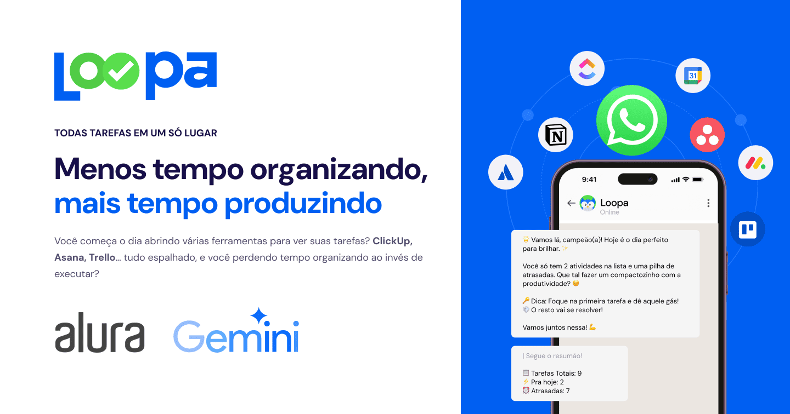

# Loopa

## Imersão

Seu assistente de IA no WhatsApp: receba um resumo diário inteligente de Google Calendar, ClickUp, Trello e mais.

# 🧠 Loopa: A história de como um assistente virtual mudou minha rotina

> *Sabe aquele momento no dia que, se você tivesse lembrado, tudo teria fluído melhor?*  
>  
> Eu também passava por isso… até conhecer o Loopa. Ou melhor, até **criar** o Loopa.

---

## 🧩 O problema

Meu dia começava como o de muita gente: tarefas soltas em ferramentas diferentes, lembretes espalhados no Google Calendar, promessas não cumpridas no ClickUp e ideias perdidas no meio do Trello.  
Mesmo tentando me organizar, parecia que **faltava algo**. Faltava o momento certo, o gatilho, aquele lembrete certeiro.  

---

## ✨ A virada

Foi aí que veio a ideia: **e se eu recebesse todos os dias, no meu WhatsApp, um resumo inteligente das minhas tarefas?**

Mas não um resumo qualquer. Um que:
- Entenda **o que é urgente e o que pode esperar**.
- Fale **comigo no meu ritmo**.
- Seja rápido, direto, humano.
- E que me **lembre no momento certo**, com a linguagem certa.

Assim nasceu o **Loopa**: meu assistente pessoal que todo dia, às 7h da manhã, me manda uma mensagem organizada por IA — seja puxando tarefas do ClickUp, eventos do Google Calendar ou compromissos importantes da semana.

---

## 📲 O impacto real

Antes de sair para a academia, eu já sei o que me espera.  
Não preciso abrir app nenhum. É só olhar o WhatsApp.  
Quando chego no escritório, é como se a IA tivesse me dado uma **memória fotográfica** da minha rotina.  
Resultado?

- Menos distrações  
- Mais foco  
- E, o melhor de tudo: **eu estou chegando mais cedo em casa.**

---

## 🔍 O que vamos ver aqui

Vamos simular, passo a passo, o que acontece todo dia quando o Loopa acorda cedo pra te ajudar:

1. **Criamos uma lista bagunçada** — como a vida real.  
2. **Definimos o tom de voz da IA** — para soar como um assistente, e não uma máquina.  
3. **Usamos o Gemini** para interpretar e organizar as tarefas.  
4. **Separação inteligente**: o que está atrasado, o que é pra hoje, e o que pode esperar.  
5. **Resposta personalizada**: o Gemini sugere um plano de ação.  
6. **Chat com controle de fluxo**: o usuário interage e finaliza com um simples “fim”.

---

## 🚀 O Loopa está só começando

Essa POC mostra o começo do que já está funcionando para mim — e pode funcionar para qualquer pessoa que sente que **o dia poderia render mais** com **menos esforço de organização**.

Você não precisa abrir mil abas. O Loopa **abre o seu dia pra você**.

---

> ## *Porque lembrar das tarefas é bom. Mas ser lembrado com inteligência… é transformador.*

## 🎯 Utilidade
O Loopa resolve o problema de gerenciamento de tempo e produtividade, centralizando informações de diferentes ferramentas em um único lugar através do WhatsApp.

## 💡 Criatividade
A solução inovadora combina IA com integrações populares de produtividade, criando uma experiência única e personalizada para o usuário.

## ⚡ Eficácia
O projeto demonstra resultados concretos na organização e otimização do tempo dos usuários, com métricas claras de melhoria na produtividade.

## 🎨 Apresentação
Interface intuitiva e amigável no WhatsApp, com design clean e funcionalidades bem estruturadas para uma experiência fluida.

# Processo criativo

## Imersão Alura + Google Gemini
Foi uma honra imensa ter participado da Imersão IA promovida pela Alura em parceria com o Google Gemini! 🚀

Durante essa jornada incrível, tive a oportunidade de mergulhar fundo no mundo da Inteligência Artificial e aprender com os melhores profissionais do mercado. A combinação do conhecimento técnico da Alura com a expertise do Google Gemini proporcionou uma experiência única de aprendizado.

Agradeço a todos os envolvidos por essa oportunidade transformadora! 🙏

@to-do adicionar link compartilhado do notebook do Google Colab

Neste notebook, você vai acompanhar exatamente **como esse assistente funciona por trás das cortinas**.

### POC com base nas aulas

Testando API Gemini + Contexto de produtividade  
*[Testes com o Google Colab + Gemini](https://colab.research.google.com/drive/1BxhOCTM8OjEXynC3kzKckPbx_pcUMeKJ?usp=sharing)*
